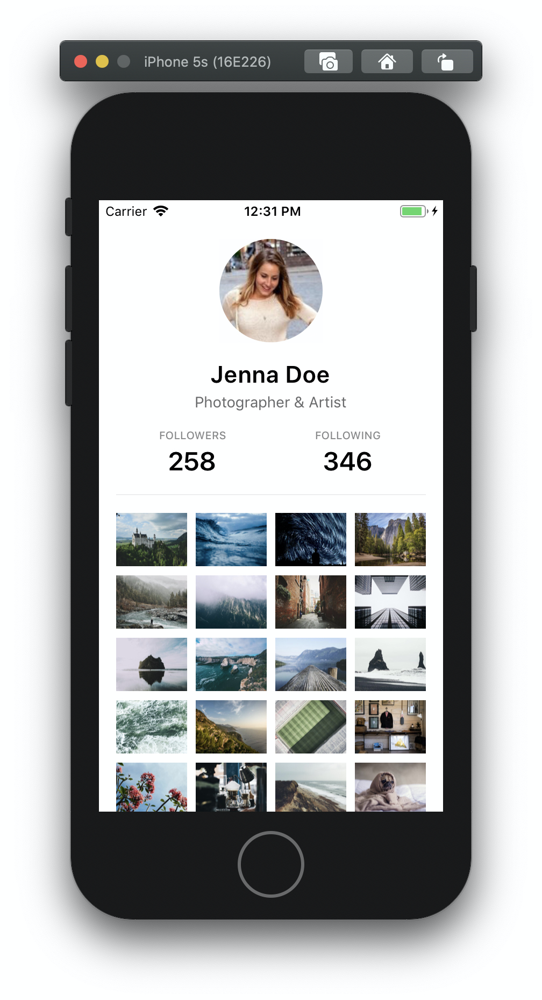
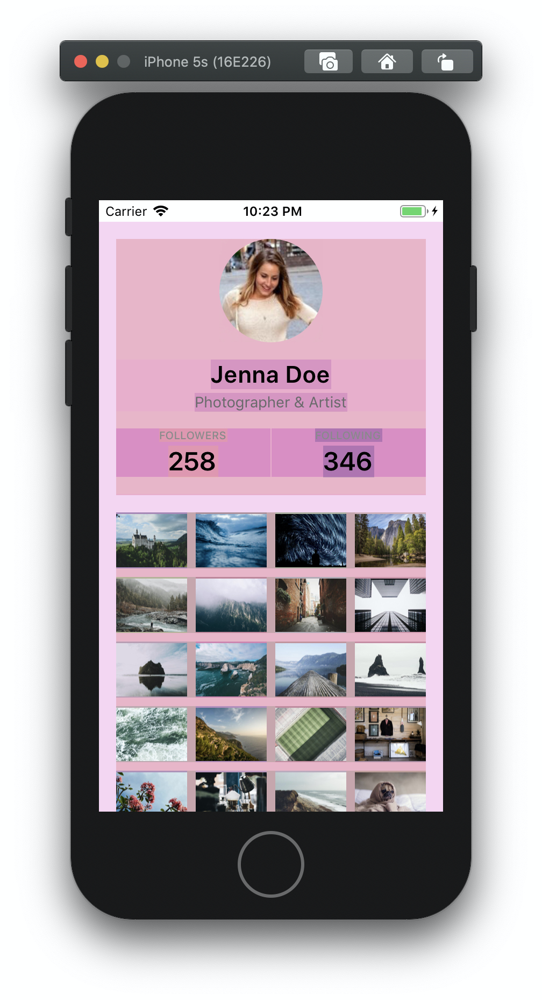

# ⚡ Stacks &middot; [](https://travis-ci.com/mobily/stacks) [](https://coveralls.io/github/mobily/stacks?branch=master) [](https://www.npmjs.com/package/@mobily/stacks)  [](http://makeapullrequest.com) [](#contributors) [](https://github.com/mobily/stacks/blob/master/LICENSE)

> Build React Native views blazingly fast.

## Motivation

Disclaimer: **Stacks** is not yet another full design system.

[Max Stoiber](https://github.com/mxstbr) has recently written an interesting [article](https://mxstbr.com/thoughts/margin) about why margin is considered harmful. There are three main disadvantages of using margin:

- margin breaks component encapsulation
- margin makes reusability harder
- margin conflicts with how designers think

I fully agree with this point of view. To me, it's obvious that handling margins across the entire project is simply difficult and might be not scalable. For web projects, a design system called [Braid](https://seek-oss.github.io/braid-design-system/foundations/layout) has developer-friendly API for building layouts. However, a similar library was missing for React Native based projects. Therefore, **Stacks** has been created and it adopts Braid Layouts API with subtle differences.

## Getting started

### Installation

```shell
yarn add @mobily/stacks
```

or with `npm`

```shell
npm install @mobily/stacks --save
```

### Prerequisites

To use **Stacks** properly you need to pass a default spacing value to a `Provider` at the top of your React tree.

```tsx
import { Provider as Stacks } from '@mobily/stacks'

const App = () => {
  return (
    <Stacks spacing={4}>
      …
    </Stacks>
  )
}
```

In short, the spacing value unit here is a logical pixel, the same as you've been using before for either _margin_ or _padding_. **Stacks** will automatically multiply the default spacing value by value of `space` (`padding` as well) passed to the components, for instance:

```tsx
<Stacks spacing={4}>…</Stacks>

<Stack space={2}>…</Stack>
// ⬆️ 4 * 2 = 8 logical pixels of the bottom margin

<Box padding={3}>…</Box>
// ⬆️ 4 * 3 = 12 logical pixels of the padding
```

Consistent and clear!

Another required thing, you always have to pass `style` property to your components if you want to use them properly within **Stacks** components.

```tsx
import { View, ViewProps } from 'react-native'
import { styles } from './styles'
// ⬆️ your custom styles

interface Props {
  …
  style?: ViewProps['style']
}

export const Placeholder = (props: Props) => {
  const { …, style } = props

  return (
    <View style={[styles.root, style]}>
      …
    </View>
  )
}
```

## Example

The following example shows how simple is building screens without using neither _margin_ nor _padding_ properties in your style sheets objects. For debugging purposes, you may want to turn the debug mode on (pass the `debug` property to the provider) or use the customizable Grid component.

|                               | Debug mode                          | Grid component                     |
| ----------------------------- | ----------------------------------- | ---------------------------------- |
|  |  |  |

```tsx
import React from 'react'
import { ScrollView, Text } from 'react-native'
import { Stack, Box, Columns, Column, Tiles } from '@mobily/stacks'

// import components, styles, etc.

const Profile = () => {
  return (
    <ScrollView>
      <Box padding={4}>
        <Stack space={4}>
          <Stack space={4} align="center">
            <Avatar source="…" size={96} />
            <Stack space={1} align="center">
              <Title>Jenna Doe</Title>
              <Description>Photographer &amp; Artist</Description>
            </Stack>
            <Columns>
              <Column>
                <Stack space={1} align="center">
                  <Text>Followers</Text>
                  <Counter>258</Counter>
                </Stack>
              </Column>
              <Column>
                <Stack space={1} align="center">
                  <Text>Following</Text>
                  <Counter>346</Counter>
                </Stack>
              </Column>
            </Columns>
            <Divider />
          </Stack>
          <Text>Photos</Text>
          <Tiles columns={4} space={2}>
            <Photo source="…" />
            <Photo source="…" />
            <Photo source="…" />
          </Tiles>
          <Text>Followers</Text>
          <Tiles columns={8} space={2}>
            <Avatar source="…" />
            <Avatar source="…" />
            <Avatar source="…" />
          </Tiles>
        </Stack>
      </Box>
    </ScrollView>
  )
}
```

## Api Reference

Full documentation is available [here](https://mobily.github.io/stacks).

## Contributors

Kudos to [@panr](https://github.com/panr) for giving this project a name!

<!-- ALL-CONTRIBUTORS-LIST:START - Do not remove or modify this section -->
<!-- prettier-ignore -->
<table><tr><td align="center"><a href="https://twitter.com/__marcin_"><br /><sub><b>Marcin Dziewulski</b></sub></a><br /><a href="https://github.com/mobily/stacks/commits?author=mobily" title="Code">💻</a> <a href="https://github.com/mobily/stacks/commits?author=mobily" title="Documentation">📖</a></td></tr></table>

<!-- ALL-CONTRIBUTORS-LIST:END -->

## License

The MIT License.

See [LICENSE](LICENSE)
